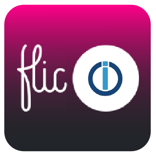

# ioBroker.flic-hub

[](https://www.npmjs.com/package/iobroker.flic-hub)
[](https://www.npmjs.com/package/iobroker.flic-hub)


[](https://david-dm.org/kyuka-dom/iobroker.flic-hub)

[](https://nodei.co/npm/iobroker.flic-hub/)


## flic-hub adapter for ioBroker

Supports integration of the flic buttons using the flic hub. The flic hub is mandatory, since this adapter requires some configuration within the flic hub SDK. To set the hub and the SDK up please follow the [tutorial](https://hubsdk.flic.io/static/tutorial/?_ga=2.180803623.1636591884.1641558110-837374246.1638371693)

After successful login to the sdk please create a new module with the following code

```javascript
const net = require('net');
const buttonManager = require("buttons");

const tcpPort = 30000;

const writeFunc = function(c, data) {
  c.write(JSON.stringify(data).toString('utf8') + "\r\n")
}

const handleConnection = function(conn) {
  const buttons = buttonManager.getButtons();
  writeFunc(conn, {name: 'buttons', buttons: buttons}) // send buttonlist immediately
  setInterval(function() {
    const buttons = buttonManager.getButtons();
    writeFunc(conn, {name: 'buttons', buttons: buttons}) // send buttonlist every 10 minutes
  }, 10 * 60 * 10000)

  buttonManager.on("buttonSingleOrDoubleClickOrHold", myFunc = function(obj) {
    console.log('button click detected: ' + JSON.stringify(obj));
    var button = buttonManager.getButton(obj.bdaddr);
		console.log(JSON.stringify(conn))
    if (conn && !conn.destroyed) writeFunc(conn, {name: 'click', eventObj: obj, button: button})
		if (conn.destroyed) {
			buttonManager.removeListener("buttonSingleOrDoubleClickOrHold", myFunc)
			conn.end();
		}
  });
}
const server = new net.createServer(handleConnection)
server.listen({port:tcpPort, host: '0.0.0.0'})
```

The adapter will automatically detect all hubs within the local network and create all buttons attached to it.

## Changelog
<!--
    Placeholder for the next version (at the beginning of the line):
    ### **WORK IN PROGRESS**
-->

### **WORK IN PROGRESS**
* (Dom) initial release

## License
MIT License

Copyright (c) 2022 Dom <dom@bugger.ch>

Permission is hereby granted, free of charge, to any person obtaining a copy
of this software and associated documentation files (the "Software"), to deal
in the Software without restriction, including without limitation the rights
to use, copy, modify, merge, publish, distribute, sublicense, and/or sell
copies of the Software, and to permit persons to whom the Software is
furnished to do so, subject to the following conditions:

The above copyright notice and this permission notice shall be included in all
copies or substantial portions of the Software.

THE SOFTWARE IS PROVIDED "AS IS", WITHOUT WARRANTY OF ANY KIND, EXPRESS OR
IMPLIED, INCLUDING BUT NOT LIMITED TO THE WARRANTIES OF MERCHANTABILITY,
FITNESS FOR A PARTICULAR PURPOSE AND NONINFRINGEMENT. IN NO EVENT SHALL THE
AUTHORS OR COPYRIGHT HOLDERS BE LIABLE FOR ANY CLAIM, DAMAGES OR OTHER
LIABILITY, WHETHER IN AN ACTION OF CONTRACT, TORT OR OTHERWISE, ARISING FROM,
OUT OF OR IN CONNECTION WITH THE SOFTWARE OR THE USE OR OTHER DEALINGS IN THE
SOFTWARE.